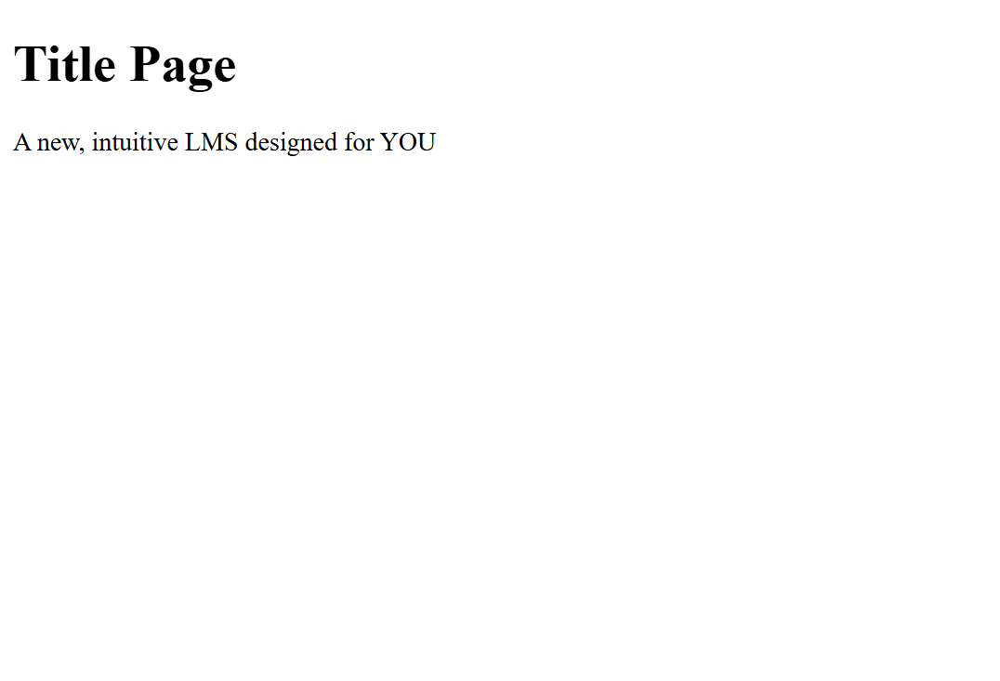

# cs131_term_project
Learning Management System for CS151 term project

HTML stubs only; no real functionality. WTForms validation runs; POST replies "Not implemented".

## Quickstart

```bash
python -m venv .venv
source .venv/bin/activate  # Windows: .venv\Scripts\activate
pip install -r requirements.txt

# Option A
export FLASK_APP=run.py
flask run

# Option B
python run.py
```

Visit:

- `http://localhost:5000/` (index)
- `http://localhost:5000/feature` (feature demo)
- `http://localhost:5000/auth/login` (WTForms login stub)

## Project Structure

```
repo/
  app/
    __init__.py
    config.py
    models.py
    forms.py
    auth/
      __init__.py
      routes.py
      templates/auth/login.html
    main/
      __init__.py
      routes.py
      templates/main/index.html
      templates/main/feature.html
    templates/base.html
    static/styles.css
  run.py
  requirements.txt
  README.md
  .gitignore
```

## Acceptance Checklist

- `flask run` (or `python run.py`) starts without exceptions.
- Visiting `/`, `/feature`, and `/auth/login` renders pages.
- WTForms form at `/auth/login` renders; POST validates and flashes **"Not implemented"**.
- `Flask-Login` installed and imported; `User` model mixes in `UserMixin` for auth props.
- SQLAlchemy models import without error; SQLite URI provided in `config.py`.
- Base template includes a nav and ``; child templates extend it.
- README includes install/run and a screenshot of a rendered page.

## MVP Features (to be implemented) 
- Instructor can create assignments.
- Instructor or TA can grade assignments.
- Students can access assignments.
- Students can submit assignments.
- All users can have a direct line of messaging communication between each other.
- Assignments can be graded by instructor and viewed by all users.
- One place for notification of assignment posting and grading, new messages and announcements.
- Grades for all courses are visible on one page.
- Assignments for all courses are visible on one page.
- Instructors can post announcements to the entire class.
- Must be able to create instructor, TA, or student accounts.
- Must be able to create a class and add students to a class.


## Screenshot




## UI Sketches


## Team Roles

- Backend: app factory, models: Joshua Choy
- Frontend: Jan David Ella
- QA: run acceptance checklist: Jan David Ella, Joshua Choy
