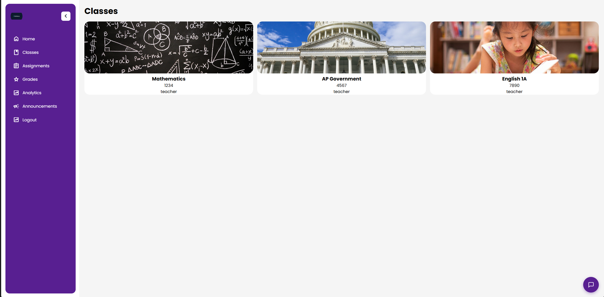
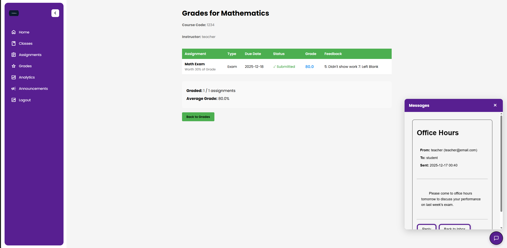

# cs131_term_project

Learning Management System for CS131 term project

A full-featured learning management system with user authentication, course management, assignment submission, messaging, and grading capabilities.

## Setup Instructions

### 1. Clone the Repository

```bash
git clone https://github.com/joshuakchoy/cs131_term_project.git
cd cs131_term_project
```

### 2. Create Virtual Environment

```bash
python -m venv .venv

# Windows
.venv\Scripts\activate

# Mac/Linux
source .venv/bin/activate
```

### 3. Install Dependencies

```bash
pip install -r requirements.txt
```

### 4. Run the Application

```bash
# Option A
python run.py

# Option B
export FLASK_APP=run.py  # Windows: set FLASK_APP=run.py
flask run
```

### 5. Access the Application

Visit `http://localhost:5000/` in your browser

## Testing

The project includes a comprehensive test suite with **70 tests** covering unit tests, route tests, and full integration tests.

### Initial Setup for Testing

Before running tests for the first time, ensure your environment is properly configured:

**Windows:**

```powershell
# 1. Make sure you're in the project directory
cd cs131_term_project

# 2. Activate your virtual environment
.\.venv\Scripts\Activate.ps1

# 3. Install testing dependencies (if not already installed)
pip install -r requirements.txt

# 4. Verify pytest is installed
pytest --version
```

**Mac/Linux:**

```bash
# 1. Make sure you're in the project directory
cd cs131_term_project

# 2. Activate your virtual environment
source .venv/bin/activate

# 3. Install testing dependencies (if not already installed)
pip install -r requirements.txt

# 4. Verify pytest is installed
pytest --version
```

### Quick Start - Run All Tests

**Windows (with virtual environment activated):**

```powershell
# Run all tests with verbose output
pytest tests/ -v

# Run all tests with summary
pytest tests/ -v --tb=short

# Run all tests quietly (just see pass/fail count)
pytest tests/ -q
```

**Windows (without activating virtual environment):**

```powershell
# Run all tests with verbose output
.\.venv\Scripts\python.exe -m pytest tests/ -v

# Run all tests with summary
.\.venv\Scripts\python.exe -m pytest tests/ -v --tb=short

# Run all tests quietly (just see pass/fail count)
.\.venv\Scripts\python.exe -m pytest tests/ -q
```

**Mac/Linux (with virtual environment activated):**

```bash
# Run all tests with verbose output
pytest tests/ -v

# Run all tests with summary
pytest tests/ -v --tb=short

# Run all tests quietly (just see pass/fail count)
pytest tests/ -q
```

**Mac/Linux (without activating virtual environment):**

```bash
# Run all tests with verbose output
.venv/bin/python -m pytest tests/ -v

# Run all tests with summary
.venv/bin/python -m pytest tests/ -v --tb=short

# Run all tests quietly (just see pass/fail count)
.venv/bin/python -m pytest tests/ -q
```

### Run Specific Test Categories

> **Note:** The commands below assume your virtual environment is activated. If not, use the full path to Python:
>
> - Windows: `.\.venv\Scripts\python.exe -m pytest ...`
> - Mac/Linux: `.venv/bin/python -m pytest ...`

#### Unit Tests (Models & Forms)

```bash
# Test database models
pytest tests/test_models.py -v

# Test form validation
pytest tests/test_forms.py -v
```

#### Route Tests

```bash
# Test basic route functionality
pytest tests/test_routes.py -v
```

#### Integration Tests (Comprehensive)

```bash
# Run all integration tests
pytest tests/test_integration.py -v

# Run specific integration test categories
pytest tests/test_integration.py::TestAuthenticationIntegration -v
pytest tests/test_integration.py::TestRoleBasedAccessControl -v
pytest tests/test_integration.py::TestCourseManagementIntegration -v
pytest tests/test_integration.py::TestAssignmentManagementIntegration -v
pytest tests/test_integration.py::TestEdgeCases -v
```

### Test Coverage Summary

**Total: 70 tests (all passing ✅)**

#### Unit Tests (4 tests)

- Model tests: User password hashing, role creation, course creation
- Form tests: Registration validation

#### Basic Route Tests (4 tests)

- Login page accessibility
- Authentication requirements
- Protected route access

#### Integration Tests (62 tests)

- **Authentication Integration (7 tests)**

  - Full registration flow
  - Duplicate email/username prevention
  - Login/logout functionality
  - Password reset flow
  - Redirects for authenticated users

- **Protected Routes (5 tests)**

  - Unauthenticated access handling
  - Authenticated user permissions
  - Access to home, grades, classes, assignments

- **Role-Based Access Control (10 tests)**

  - Student restrictions (cannot access teacher portal, create courses/assignments)
  - Teacher permissions (can create courses/assignments, access teacher portal)
  - TA permissions and restrictions
  - Analytics access by role

- **Course Management (4 tests)**

  - Course creation flow
  - Duplicate course code prevention
  - Course viewing permissions
  - Enrollment-based course visibility

- **Assignment Management (5 tests)**

  - Assignment creation flow
  - Assignment visibility based on enrollment
  - Sorting by due date and course
  - Teacher validation (must have courses to create assignments)

- **Grades Integration (3 tests)**

  - Student grade viewing
  - Teacher grade access
  - Grade average calculations

- **Analytics (3 tests)**

  - Student analytics with grades
  - Student analytics without grades
  - Teacher analytics view

- **Edge Cases (7 tests)**

  - Nonexistent course access (404)
  - Invalid course ID format
  - Empty assignment lists
  - Root path redirects
  - Logout without login
  - Invalid password reset tokens
  - Nonexistent email handling

- **TA Integration (8 tests)**

  - TA page access permissions
  - TA restrictions (cannot create courses/assignments, access teacher portal)
  - Course assignment visibility
  - Assignment viewing for assigned courses

- **Template Rendering (10 tests)**
  - All major templates render correctly
  - Form elements present
  - Required content verification

### Running Specific Tests

```bash
# Run a specific test function
pytest tests/test_integration.py::TestAuthenticationIntegration::test_registration_flow -v

# Run tests matching a pattern
pytest tests/ -k "authentication" -v

# Run tests with coverage report
pytest tests/ --cov=app --cov-report=html
```

### Understanding Test Output

```bash
# Detailed output with full traceback
pytest tests/ -v --tb=long

# Short output with just error lines
pytest tests/ -v --tb=short

# One-line output per test
pytest tests/ -v --tb=line

# No traceback, just pass/fail
pytest tests/ -v --tb=no
```

### How Tests Work

The test suite uses **pytest** with Flask-specific testing utilities:

1. **Test Database**: Each test uses a temporary SQLite database that is:

   - Created fresh before each test
   - Populated with test data via fixtures
   - Completely destroyed after the test completes
   - Never affects your production `app.db`

2. **Test Client**: Simulates browser requests without running the server:

   - `client.get('/route')` - Simulates visiting a page
   - `client.post('/route', data={...})` - Simulates form submission
   - `follow_redirects=True` - Follows redirect responses

3. **Fixtures**: Pre-configured test data (defined in `conftest.py`):

   - `app` - Test Flask application
   - `client` - Test request client
   - `student_user`, `teacher_user`, `ta_user` - Test users
   - `authenticated_client` - Pre-logged-in client
   - `sample_course`, `sample_assignment` - Test data

4. **Test Isolation**: Each test runs independently:
   - No test affects another test
   - Database reset between tests
   - Session cleared between tests

### Running Tests During Development

```bash
# Watch mode: re-run tests on file changes (requires pytest-watch)
pip install pytest-watch
ptw tests/

# Run only failed tests from last run
pytest --lf

# Run failed tests first, then rest
pytest --ff

# Stop on first failure (useful for debugging)
pytest -x

# Run specific number of tests in parallel (requires pytest-xdist)
pip install pytest-xdist
pytest tests/ -n 4  # Run with 4 workers
```

### Troubleshooting Tests

**Problem: Tests fail with "ModuleNotFoundError"**

```bash
# Solution: Install dependencies
pip install -r requirements.txt
```

**Problem: Tests fail with database errors**

```bash
# Solution: Delete test database and re-run
rm instance/test.db  # Mac/Linux
del instance\test.db  # Windows
pytest tests/ -v
```

**Problem: Want to see print statements in tests**

```bash
# Solution: Use -s flag to show print output
pytest tests/ -v -s
```

### Integration Test Features

The integration tests use `client.get()` and `client.post()` to:

- **Test full routes** end-to-end
- **Verify templates render** correctly with expected content
- **Check redirects** work as intended
- **Validate role-based access** control
- **Handle edge cases** like invalid data, missing resources
- **Test complete workflows** (registration → login → feature access)

### Test Fixtures Available

The test suite includes the following fixtures (defined in `conftest.py`):

- `app` - Test Flask application instance
- `client` - Test client for making requests
- `student_user` - Pre-created student user
- `teacher_user` - Pre-created instructor user
- `ta_user` - Pre-created TA user
- `authenticated_client` - Client logged in as student
- `authenticated_teacher_client` - Client logged in as teacher
- `authenticated_ta_client` - Client logged in as TA
- `sample_course` - Pre-created test course
- `sample_assignment` - Pre-created test assignment

### Best Practices for Testing

1. **Run tests before committing**: Ensure all tests pass
2. **Write tests for new features**: Add integration tests for new routes
3. **Test edge cases**: Include tests for error conditions
4. **Use fixtures**: Leverage existing fixtures for consistency
5. **Keep tests isolated**: Each test should be independent

All tests must pass before merging to main branch.

## Project Structure

```
cs131_term_project/
  app/
    __Init__.py
    config.py
    models.py
    forms.py
    auth/
      __init__.py
      routes.py
      templates/
        auth/
          login.html
          register.html
          forgot_password.html
          reset_password.html
    main/
      __init__.py
      routes.py
      templates/
        main/
          home.html
          assignments.html
          classes.html
          grades.html
          analytics.html
          teacher_portal.html
          create_course.html
          create_assignment.html
          submit_assignment.html
          view_course.html
          view_grades.html
          view_submissions.html
          messages.html
          sent_messages.html
          compose_message.html
          view_message.html
          announcements.html
          create_announcement.html
          manage_tas.html
          default.html
    templates/
      base.html
      sidebar.html
      messageBase.html
      registerBase.html
    static/
      styles.css
      side.css
      script.js
      logo.jpg
      math.png
    analytics/
    assignments/
    classes/
    grades/
  tests/
    conftest.py
    test_models.py
    test_routes.py
    test_forms.py
    test_integration.py
  instance/
    app.db (SQLite database, created on first run)
  uploads/
    (student submission files)
  run.py
  requirements.txt
  README.md
  .gitignore
  *.png (UI screenshots)
```

## Acceptance Checklist

- `flask run` (or `python run.py`) starts without exceptions.
- Visiting `/`, `/feature`, and `/auth/login` renders pages.
- WTForms form at `/auth/login` renders; POST validates and flashes **"Not implemented"**.
- `Flask-Login` installed and imported; `User` model mixes in `UserMixin` for auth props.
- SQLAlchemy models import without error; SQLite URI provided in `config.py`.
- Base template includes a nav and ``; child templates extend it.
- README includes install/run and a screenshot of a rendered page.

## MVP Features (to be implemented)

- Instructor can create assignments.
- Instructor or TA can grade assignments.
- Students can access assignments.
- Students can submit assignments.
- All users can have a direct line of messaging communication between each other.
- Assignments can be graded by instructor and viewed by all users.
- One place for notification of assignment posting and grading, new messages and announcements.
- Grades for all courses are visible on one page.
- Assignments for all courses are visible on one page.
- Instructors can post announcements to the entire class.
- Must be able to create instructor, TA, or student accounts.
- Must be able to create a class and add students to a class.

## Test Files

The testing infrastructure includes:

- **`conftest.py`** - Pytest configuration and shared fixtures

  - Application factory with test configuration
  - Database setup/teardown
  - User fixtures (student, teacher, TA)
  - Authenticated client fixtures
  - Sample data fixtures (courses, assignments)

- **`test_models.py`** - Database model unit tests

  - User password hashing
  - User role creation
  - Course creation with relationships

- **`test_routes.py`** - Basic route functionality tests

  - Login page accessibility
  - Authentication with valid credentials
  - Protected route requirements

- **`test_forms.py`** - Form validation tests

  - Registration form password matching
  - Form field validation

- **`test_integration.py`** - Comprehensive integration tests (62 tests)
  - Full authentication workflows
  - Role-based access control
  - Course and assignment management
  - Template rendering verification
  - Edge case handling
  - TA functionality
  - Grades and analytics

## Test Results

✅ **All 70 tests passing**

Run `pytest tests/ -v` to see detailed test results.

## Technologies Used

- **Backend**: Flask 3.0+, Python
- **Database**: SQLAlchemy 2.0+ with SQLite
- **Authentication**: Flask-Login 0.6+
- **Forms**: WTForms 3.1+, Flask-WTF 1.2+
- **Testing**: Pytest 7.4+, pytest-flask, pytest-cov
- **Frontend**: HTML5, CSS3, JavaScript (ES6+)
- **Icons**: Google Material Symbols
- **File Uploads**: Secure file handling with werkzeug

## Database Models

### User

- Username, email, password (hashed)
- Role: student, instructor, or TA
- Relationships: courses taught, courses enrolled, submissions, TA assignments, messages

### Course

- Title, description, course code
- Instructor (foreign key to User)
- Relationships: assignments, enrollments, announcements, TA assignments

### Assignment

- Title, description, due date
- Course (foreign key)
- Relationships: submissions

### Submission

- Student, assignment references
- Content (text), file path
- Submission timestamp, grade

### Enrollment

- Links students to courses

### Message

- Sender, recipient references
- Subject, body, timestamp
- Read/unread status

### Announcement

- Course, author references
- Title, content, timestamp

### TAAssignment

- Links TAs to courses they assist with

## Features Implemented

### Authentication & User Management

- ✅ User registration with role selection (Student, Instructor, TA)
- ✅ Login/logout functionality
- ✅ Password hashing and secure authentication
- ✅ Password reset functionality
- ✅ Role-based access control

### Course Management

- ✅ Instructors can create courses
- ✅ Students can enroll in courses
- ✅ Course listing and details view
- ✅ Course thumbnails and descriptions
- ✅ TA assignment to courses
- ✅ Enrollment management through teacher portal

### Assignment System

- ✅ Instructors can create assignments with due dates
- ✅ Students can view assignments for enrolled courses
- ✅ Students can submit assignments (text + file upload)
- ✅ Assignment resubmission capability
- ✅ Submission tracking and status indicators
- ✅ File uploads (PDF, DOC, DOCX, TXT, ZIP, code files)
- ✅ Instructors can view all submissions per assignment
- ✅ Assignment sorting (by due date, by course)
- ✅ Completion badges for submitted assignments
- ✅ Download submitted files

### Messaging & Communication

- ✅ Direct messaging between users
- ✅ Inbox and sent messages
- ✅ Message composition with subject and body
- ✅ Read/unread status tracking
- ✅ Floating messaging hub (overlay interface)
- ✅ Course-wide announcements by instructors
- ✅ Message notifications

### Grading

- ✅ Instructors can view student submissions
- ✅ Grade tracking per assignment
- ✅ Grades page showing all course grades by student

### User Interface

- ✅ Responsive sidebar navigation with Material Design icons
- ✅ Collapsible sidebar with state persistence
- ✅ Modal dialogs for course management
- ✅ Flash messages for user feedback
- ✅ Custom styling with CSS
- ✅ Floating message button overlay
- ✅ Clickable assignment cards
- ✅ Visual completion indicators

### Teacher Portal

- ✅ Dashboard for instructors
- ✅ Course overview with enrollment statistics
- ✅ Student enrollment management via modal interface
- ✅ Quick access to create assignments/courses
- ✅ View all courses taught
- ✅ Manage students in courses

### Analytics

The analytics page provides visual performance insights for students using **Chart.js** interactive bar charts.

#### Student Analytics Features

**What Students See:**

- Individual performance charts for each assignment in enrolled courses
- Side-by-side comparison: Student score vs. Class average
- GPA calculation based on all graded assignments
- Performance tracking across all courses

#### How the Charts Work

**Chart Components:**

- **Bar Chart**: Two bars per assignment
  - 🟢 **Green Bar** = Your score on the assignment
  - 🔵 **Blue Bar** = Class average for that assignment
- **Y-Axis**: Score percentage (0-100%)
- **Interactive Tooltips**: Hover over any bar to see exact score

**Data Displayed:**

```
Assignment: "Homework 1"
├── Your Score: 85%        (green bar)
├── Class Average: 78%     (blue bar)
├── Class High: 95%        (shown in card)
└── Class Low: 62%         (shown in card)
```

**GPA Calculation:**

1. Average calculated per course (all graded assignments)
2. Percentage converted to 4.0 scale:
   - 90-100% = 4.0
   - 80-89% = 3.0
   - 70-79% = 2.0
   - 60-69% = 1.0
   - Below 60% = 0.0
3. Overall GPA = Average of all course GPAs

## Login Page


## Student Page Sample


- Easy access to messages and tabs via sidebar

## Classes Page



## Grades w/ Messaging Overlay



## UI Sketches


## User Roles

### Instructor

- Create and manage courses
- Create and grade assignments
- View all student submissions
- Post announcements to classes
- Manage TAs for their courses
- Send messages to students and TAs

### Student

- Enroll in courses
- View and submit assignments
- Track grades across all courses
- Receive announcements and messages
- Resubmit assignments before due date
- View assignment completion status

### Teaching Assistant (TA)

- Assist with grading assignments
- Access course materials
- Communicate with students
- View submissions for assigned courses

## Team Roles

- **Backend and Documentation**: Joshua Choy
- **Models**: Joshua Choy, Jan David Ella
- **Frontend & Styling**: Jan David Ella
- **Testing & QA**: Jan David Ella, Joshua Choy
