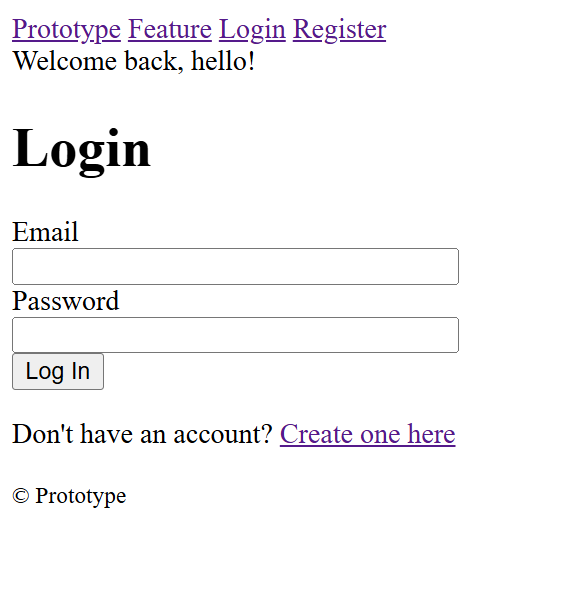

# cs131_term_project
Learning Management System for CS131 term project

A full-featured learning management system with user authentication, course management, assignment submission, messaging, and grading capabilities.

## Setup Instructions

### 1. Clone the Repository
```bash
git clone https://github.com/joshuakchoy/cs131_term_project.git
cd cs131_term_project
```

### 2. Create Virtual Environment
```bash
python -m venv .venv

# Windows
.venv\Scripts\activate

# Mac/Linux
source .venv/bin/activate
```

### 3. Install Dependencies
```bash
pip install -r requirements.txt
```

### 4. Run the Application
```bash
# Option A
python run.py

# Option B
export FLASK_APP=run.py  # Windows: set FLASK_APP=run.py
flask run
```

### 5. Access the Application
Visit `http://localhost:5000/` in your browser

## Testing

### Run All Tests
```bash
pytest tests/ -v
```

### Run Specific Test Files
```bash
pytest tests/test_models.py -v
pytest tests/test_routes.py -v
pytest tests/test_forms.py -v
```

### Test Coverage
The test suite includes 8 unit tests covering:
- **Models**: User authentication, course creation
- **Routes**: Login, protected routes, authentication
- **Forms**: Registration validation

All tests must pass before merging to main branch.

## Project Structure

```
repo/
  app/
    __init__.py
    config.py
    models.py
    forms.py
    auth/
      __init__.py
      routes.py
      templates/auth/login.html
    main/
      __init__.py
      routes.py
      templates/main/index.html
      templates/main/feature.html
    templates/base.html
    static/styles.css
  run.py
  requirements.txt
  README.md
  .gitignore
```

## Acceptance Checklist

- `flask run` (or `python run.py`) starts without exceptions.
- Visiting `/`, `/feature`, and `/auth/login` renders pages.
- WTForms form at `/auth/login` renders; POST validates and flashes **"Not implemented"**.
- `Flask-Login` installed and imported; `User` model mixes in `UserMixin` for auth props.
- SQLAlchemy models import without error; SQLite URI provided in `config.py`.
- Base template includes a nav and ``; child templates extend it.
- README includes install/run and a screenshot of a rendered page.

## MVP Features (to be implemented) 
- Instructor can create assignments.
- Instructor or TA can grade assignments.
- Students can access assignments.
- Students can submit assignments.
- All users can have a direct line of messaging communication between each other.
- Assignments can be graded by instructor and viewed by all users.
- One place for notification of assignment posting and grading, new messages and announcements.
- Grades for all courses are visible on one page.
- Assignments for all courses are visible on one page.
- Instructors can post announcements to the entire class.
- Must be able to create instructor, TA, or student accounts.
- Must be able to create a class and add students to a class.

## Test Coverage

### Models (3 tests)
1. **test_user_password_hashing** - Verifies password hashing and verification works correctly
2. **test_user_creation_with_role** - Tests creating users with different roles (student, instructor)
3. **test_course_creation** - Tests course creation and instructor relationship

### Routes (4 tests)
4. **test_login_page_accessible** - Verifies login page loads successfully
5. **test_login_with_valid_credentials** - Tests successful login with correct credentials
6. **test_assignments_requires_login** - Ensures protected routes require authentication
7. **test_authenticated_user_can_access_assignments** - Verifies authenticated users can access assignments

### Forms (1 test)
8. **test_registration_form_validates_matching_passwords** - Tests form validation for matching passwords

## Running Tests

```bash
# Run all tests
pytest

# Run with verbose output
pytest -v

# Run specific test file
pytest tests/test_models.py

# Run specific test
pytest tests/test_models.py::TestUserModel::test_user_password_hashing
```

## Test Files
- `conftest.py` - Pytest configuration and fixtures
- `test_models.py` - Model tests
- `test_routes.py` - Route/view tests
- `test_forms.py` - Form validation tests
- `pytest.ini` - Pytest configuration

## Test Results
✅ **All 8 tests passing**

## Screenshot




## UI Sketches


## User Roles

### Instructor
- Create and manage courses
- Create and grade assignments
- View all student submissions
- Post announcements to classes
- Manage TAs for their courses
- Send messages to students and TAs

### Student
- Enroll in courses
- View and submit assignments
- Track grades across all courses
- Receive announcements and messages
- Resubmit assignments before due date
- View assignment completion status

### Teaching Assistant (TA)
- Assist with grading assignments
- Access course materials
- Communicate with students
- View submissions for assigned courses

## Team Roles

- **Backend & Models**: Joshua Choy
- **Frontend & Styling**: Jan David Ella
- **Testing & QA**: Jan David Ella, Joshua Choy


